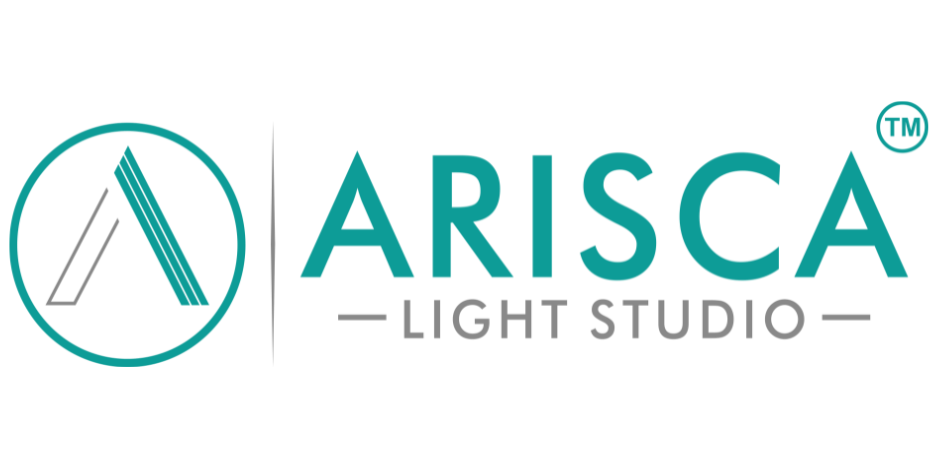

# Arisca Light Studio ✦ Ahmedabad

<div align="center">

<p align="center">
  
</p>

### *"Light that lives in your room."*

**Architectural Lighting Destination • Bespoke Chandeliers • Anti-Glare COB Downlights**

[](https://react.dev/)
[](https://vitejs.dev/)
[](https://developer.mozilla.org/en-US/docs/Web/JavaScript)
[](https://www.w3.org/Style/CSS/)
[](#-license)

**[🌐 Live Demo (GitHub Pages)](https://bluenovatechin.github.io/Arisca-Light-Studio/)** • **[📍 Showroom Location](#-visit-the-studio)** • **[🚀 Quick Start](#-getting-started)** • **[📐 Project Structure](#-project-structure)**

---

</div>

## 📖 Overview

**Arisca Light Studio** is an architectural lighting studio based on **Jagatpur Road, Ahmedabad, Gujarat**. We specialize in technical glare-free architectural illumination (deep-recessed UGR < 19 COBs, magnetic track systems, trimless profiles) and statement decorative fixtures (bespoke chandeliers, artisanal pendants, linear suspensions, and landscape luminaires).

This repository contains the official high-performance, mobile-first **Digital Showroom & Web Application**. Built with React 18 and Vite, it bridges technical lighting engineering with a tactile, luxury online shopping experience.

---

## ✨ Key Features & Interactive Experiences

### 💡 1. "Lights On" Day/Night Photometric Simulation
- **Tactile Pull-Cord & Stage Switch**: Experience fixtures in two distinct states—pristine daylight studio photography vs. atmospheric warm-lit evening ambiance.
- **Interactive Dual-State Slider**: Before-and-after comparison slider showing how each luminaire illuminates real room surfaces and architectural textures.

### 🧮 2. Engineered Room Lux Calculator
- **Instant Photometric Layout**: Input room dimensions (length, width) and ceiling heights (8 ft to 14 ft+).
- **Target Lux Standards**: Presets tailored to Indian architectural norms (Living Room, Dining, Kitchen, Master Bedroom, Home Office, Powder Room).
- **Instant Output**: Calculates total target lumens, optimal fixture count, recommended wattage (7W, 12W, 18W), and beam spread advice.

### 🏢 3. Architectural Downlights Catalog (`/shop`)
- **Anti-Glare Optics**: Engineered deep-recessed COB downlights with UGR < 19 comfort standards.
- **Parametric Filtering**: Filter by mounting style (Trimless, Recessed, Surface Cylinder, Track), color temperature (2700K Warm, 3000K Warm White, 4000K Natural), wattage, and reflector finishes (Rose Gold, Matte Black, Specular Chrome).
- **Interactive Beam Selector**: Visual demonstration of narrow accent beams (15°/24°) vs. wide general ambient floods (36°/60°).

### 💎 4. Curated Decorative Collection (`/collection`)
- Filter across **Chandeliers, Pendants, Wall Sconces, Floor & Table Lamps, and Magnetic Track systems**.
- Detailed spec sheets with dimensions, materials (solid brass, k9 crystal, brushed aluminum), and photometric specifications.

### 📲 5. One-Tap WhatsApp Inquiry Basket
- Clients can curate a project fixture list into the slide-over **Inquiry Basket**.
- Direct-to-WhatsApp handoff generates a formatted quotation summary with product names, wattages, quantities, and site notes—connecting clients immediately to our Ahmedabad studio lighting consultants.

### 📐 6. Trade Partner Portal (`/interior-designers`)
- Dedicated workflow for **Architects, Interior Designers, and Lighting Consultants**.
- Trade pricing tiers, physical material sample loan kits, IES / Dialux photometric files, and on-site project survey booking.

### 🌙 7. Dual Architectural Theming (Light & Dark)
- **Gallery Light**: Airy gallery white and warm stone accents suited for daytime design reviews.
- **Obsidian Dark**: Rich charcoal room aesthetic (`#0e1112`) with luminous teal accents, preventing glare and highlighting luminaire output.
- **Zero-Flicker Persistence**: Preserved via `localStorage` and system color-scheme detection.

### 🔍 8. Global Instant Search Modal
- Keyboard shortcut support (`Ctrl + K` / `Cmd + K`).
- Real-time search across categories, model numbers, beam angles, and finishes with live result previews.

---

## 🛠️ Tech Stack & Architecture

| Layer | Technologies |
| :--- | :--- |
| **Framework** | [React 18.3](https://react.dev/) (Hooks, Context API, Suspense) |
| **Bundler & Dev Server** | [Vite 6.2](https://vitejs.dev/) with HMR (Hot Module Replacement) |
| **Styling & Design System** | Custom CSS Architecture (`studio.css`, `index.css`, `fonts.css`) using CSS Custom Properties (Tokens), Fluid Typography, and Glassmorphism |
| **Iconography** | [Lucide React](https://lucide.dev/) (Feather icon successor) |
| **State Management** | Context API (`CartContext` for basket/modals, `ThemeContext` for dual-theme toggles) |
| **Routing** | Zero-dependency SPA client-side router with hash/pathname normalization and base-path prefixing |
| **Performance & SEO** | JSON-LD Structured Data, Semantic HTML5, WebP Assets, WCAG AA Accessibility Contrast |

---

## 📁 Project Structure

```text
Arisca-Light-Studio/
├── public/                       # Static public assets (images, PDFs, fonts)
│   ├── assets/
│   │   ├── branding/             # Studio logos and emblems
│   │   ├── downlights/           # COB, cylinder, and track light imagery
│   │   ├── collection/           # Chandeliers, pendants, wall lamps
│   │   └── client-diaries/       # Real installation project photography
│   └── catalogs/                 # Downloadable PDF architectural catalogs
├── src/
│   ├── components/               # Reusable UI components
│   │   ├── Header.jsx            # Sticky navigation, mega menu, theme toggle
│   │   ├── Footer.jsx            # Studio footer with contact info & sitemap
│   │   ├── CartDrawer.jsx        # Slide-over inquiry basket drawer
│   │   ├── LightingCalculator.jsx# Interactive room lux & wattage calculator
│   │   ├── GlobalSearchModal.jsx # Quick search modal (Ctrl+K)
│   │   ├── ConsultationModal.jsx # On-site visit booking modal
│   │   ├── LightCard.jsx         # Interactive dual-state collection card
│   │   ├── ProductCard.jsx       # Downlight technical product card
│   │   ├── SeoHead.jsx           # Dynamic document title & meta tags
│   │   └── Toast.jsx             # Action feedback notifications
│   ├── context/
│   │   ├── CartContext.jsx       # Inquiry basket & modal visibility state
│   │   └── ThemeContext.jsx      # Light / Dark theme provider & OS sync
│   ├── data/
│   │   ├── ariscaData.js         # Showroom info, FAQs, downlights catalog data
│   │   ├── collection.js         # Category metadata and filter taxonomy
│   │   └── collection.json       # Structured decorative fixtures database
│   ├── pages/                    # Application route views
│   │   ├── HomePage.jsx          # Studio flagship landing page
│   │   ├── ShopPage.jsx          # Downlights catalog with parametric filters
│   │   ├── ProductDetailPage.jsx # Individual fixture specs & photometric view
│   │   ├── CollectionPage.jsx    # Decorative luminaires gallery
│   │   ├── CollectionItemPage.jsx# Single decorative piece detailed view
│   │   ├── AboutPage.jsx         # Studio heritage, vision & team
│   │   ├── ContactPage.jsx       # Showroom map, direct lines & inquiry form
│   │   ├── HomeConsultancyPage.jsx# Complimentary lux audit booking page
│   │   ├── InteriorDesignersPage.jsx# Architect & Trade partner portal
│   │   ├── ClientDiariesPage.jsx # Luxury residential project showcase
│   │   ├── CatalogsPage.jsx      # Spec sheet & catalog PDF downloads
│   │   ├── WishlistPage.jsx      # Saved fixtures list
│   │   └── NotFoundPage.jsx      # 404 fallback page
│   ├── utils/
│   │   ├── analytics.js          # Lightweight privacy-friendly pageview tracker
│   │   ├── formValidation.js     # Form field sanitation & spam honeypot
│   │   └── whatsapp.js           # Formatted WhatsApp inquiry payload generator
│   ├── App.jsx                   # Application root & client-side router
│   ├── index.css                 # Base design system tokens & typography
│   ├── studio.css                # Architectural components & dark theme system
│   └── main.jsx                  # React DOM root entry point
├── index.html                    # HTML5 shell with preloaded fonts & schema
├── vite.config.js                # Vite build configuration with base-path plugin
└── package.json                  # Dependencies and execution scripts
```

---

## 🚀 Getting Started

Follow these instructions to set up the project locally on your machine.

### Prerequisites

Ensure you have the following installed:
- **Node.js**: v18.0.0 or higher
- **npm**: v9.0.0 or higher (comes bundled with Node.js)
- **Git**

### Installation

1. **Clone the repository**:
   ```bash
   git clone https://github.com/bluenovatechin/Arisca-Light-Studio.git
   cd Arisca-Light-Studio
   ```

2. **Install project dependencies**:
   ```bash
   npm install
   ```

3. **Start the local development server**:
   ```bash
   npm run dev
   ```

4. **Open in your browser**:
   Navigate to `http://localhost:3000` (or the port displayed in your terminal).

---

## 📜 Available NPM Scripts

| Command | Description |
| :--- | :--- |
| `npm run dev` | Starts Vite dev server with Hot Module Replacement on `http://localhost:3000`. |
| `npm run build` | Compiles and minifies the application into production-ready assets inside `dist/`. |
| `npm run preview` | Starts a local web server to preview the production bundle from `dist/`. |

---

## 🌐 Deployment Configuration

The application is configured to deploy effortlessly to both custom domains and GitHub Pages:

### 1. GitHub Pages (Subfolder Base)
The repository automatically handles subfolder hosting (e.g. `https://bluenovatechin.github.io/Arisca-Light-Studio/`) via `vite.config.js`:
```bash
npm run build
```

### 2. Custom Domain (Root Base `/`)
When building for a dedicated apex/root domain (e.g. `https://www.ariscalightstudio.com/`), pass the `BASE_PATH` environment variable:
```bash
BASE_PATH=/ npm run build
```

---

## 🎨 Design System & Color Tokens

Arisca Light Studio uses an architectural color hierarchy defined via CSS Custom Properties:

| Token | Light Value | Dark Value | Purpose |
| :--- | :--- | :--- | :--- |
| `--teal` | `#14958f` | `#20c7be` | Signature studio accent color |
| `--paper` | `#ffffff` | `#0e1112` | Background canvas surface |
| `--surface` | `#f6f7f6` | `#161a1b` | Elevated cards and containers |
| `--ink` | `#1f2628` | `#eef1f0` | High-contrast body & header typography |
| `--solid` | `#1f2628` | `#f2ede3` | Primary action button fill |
| `--on-solid` | `#ffffff` | `#14191a` | Text on primary action buttons |
| `--whatsapp-green` | `#25d366` | `#25d366` | Instant inquiry CTA highlight |

---

## 📍 Visit the Studio

If you are an architect, builder, interior designer, or homeowner in Gujarat, visit our experience center to inspect anti-glare optics in person:

- **Address**: Money Plant High Street, Jagatpur Road, Ahmedabad, Gujarat 382470
- **Phone**: [+91 98980 86656](tel:+919898086656)
- **WhatsApp**: [+91 98980 86656](https://wa.me/919898086656)
- **Email**: info@ariscalightstudio.com
- **Hours**: Monday – Saturday: 10:00 AM – 8:00 PM (Sunday by appointment)

---

## 📄 License

© 2026 **Arisca Light Studio**. All rights reserved.  
The brand assets, photography, architectural lighting data, and proprietary design system are the property of Arisca Light Studio.
